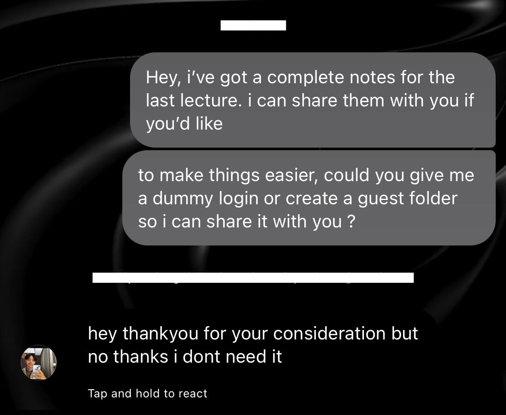

# Social Engineering Writeups

This repository contains two social engineering exercises completed for the cybersecurity assignment: **Quid Pro Quo** and **Pretexting**.  
All simulations were conducted ethically, with consent, and no real credentials or sensitive data were collected.  
Evidence screenshots are anonymized and blurred.

---

## Exercise 1: Quid Pro Quo

### Objective
Demonstrate how offering a benefit can pressure targets into sharing information, and identify defenses that reduce this risk.

### Scenario
I offered free study notes and assignment guidance. In return, I requested a dummy login or guest folder to simulate how attackers exploit reciprocity.

### Execution
1. Crafted a believable offer (study notes).  
2. Sent the message to a consenting peer.  
3. Requested access in exchange.  
4. Recorded the response.  

### Evidence
  

### Reflection
- **Strengths:** Reciprocity bias makes people more likely to comply.  
- **Weaknesses:** Security-aware peers request safer alternatives.  
- **Lesson learned:** Always verify offers before sharing information.

---

## Exercise 2: Pretexting

### Objective
Show how a fabricated role or scenario can elicit information, and document defenses that block these attempts.

### Scenario
I posed as IT support, claiming to help with login issues. The goal was to test whether authority cues prompt disclosures.

### Execution
1. Designed a convincing IT-style message.  
2. Sent the message to a consenting peer.  
3. Requested a dummy student ID for verification.  
4. Recorded the outcome.  

### Evidence

### Reflection
- **Strengths:** Authority and helpful intent reduce suspicion.  
- **Weaknesses:** Verification culture exposes pretexts quickly.  
- **Lesson learned:** Always confirm identity via official channels.

---

## Conclusion
Both exercises highlight how attackers exploit **trust, reciprocity, and authority**.  
Defenses include:
- Clear policies against exchanging access for favors.  
- Verification-first culture.  
- Training individuals to recognize suspicious offers and pretexts.
